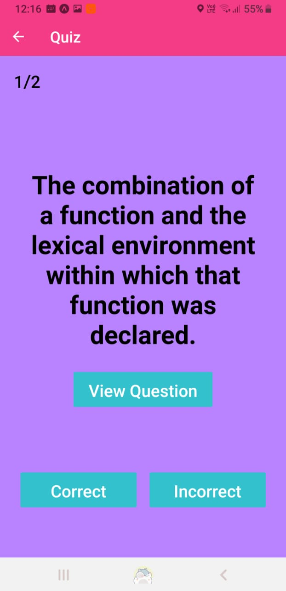

## FlashCard.
##### Mobile Flashcards is Project 3 of Udacity's React Nanodegree. It is a simple iOS and Android flashcards app built using React Native. that allows users to create questions and arrange them in decks. it allows users to question themselves on individual deck and shows the average of correct questions over the entire questions
######    

######    


## How to Run
##### The application is created using expo init To get started; navigate to the project directory.

#### install all project dependencies by running
### ```yarn install```
#### To start the dev server by running
### ```yarn start```

## platforms.
##### This project should work fine both on android and ios, however it has only been tested on android.